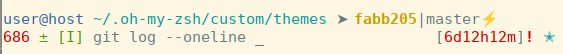
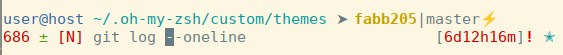

# Custom Z shell configurations

<!-- Use https://jbt.github.io/markdown-editor/ for preview before push -->

My custom configurations of the [Z shell](https://en.wikipedia.org/wiki/Z_shell) based on the [Oh My ZSH framework](https://ohmyz.sh/)

*\- Enhanced vi-mode indicator for better distinction between insert and normal mode*

